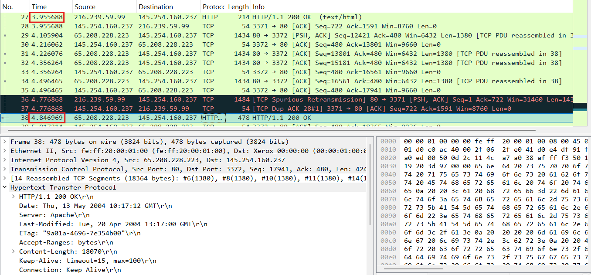

  <h1 class="text-align: center;font-weight: bold">Praktikum  Workshop Administrasi Jaringan</h1>
  <h3 class="text-align: center;">Dosen Pengampu : Dr. Ferry Astika Saputra, S.T., M.Sc.</h3>

 

  
  <h3 style="text-align: center;">Disusun Oleh : </h3>
  

    <strong>Dewangga Wahyu Putera Wangsa (3123500007)</strong> 
  

<h3 style="text-align: center;line-height: 1.5">Politeknik Elektronika Negeri Surabaya Departemen Teknik Informatika Dan Komputer Program Studi Teknik Informatika 2025/2026</h3>
  

# Tugas review Deskripsi : 
## 1.	Analisa file http.cap dengan wireshark : Versi HTTP yang digunakan, IP address dari client maupun server, waktu dari client mengirimkan HTTP request., Waktu dari server mengirimkan server dan berapa durasinya 

•   Versi HTTP: 1.1

•	Ip address client : 145.254.160.237

•	Ip address server: 65.208.228.223

•	Waktu dari client mengirimkan HTTP request : 0,911310

•	Waktu dari server mengirimkan server: 4,846969

•	Berapa durasinya: 4,846969 - 3,95568 = 0,891281
 
## 2.	Deskripsi gambar pada slide 
 

Komputer berkomunikasi melalui berbagai lapisan jaringan, seperti yang ditunjukkan pada gambar di atas.

•	Layer Data Link bertanggung jawab atas komunikasi langsung antara perangkat yang terhubung secara fisik dalam jaringan yang sama. Lapisan ini juga mendeteksi dan memperbaiki kesalahan agar data sampai dengan benar.

•	Layer Network mengatur komunikasi antar perangkat di jaringan yang berbeda. Lapisan ini mengatur alamat tujuan dan menentukan rute terbaik agar data dapat dikirim ke perangkat lain meskipun mereka berada di jaringan yang berbeda.

•	Layer Transport menangani komunikasi antar aplikasi di berbagai perangkat. Lapisan ini memastikan data dikirim dengan aman dan tanpa gangguan, membagi data menjadi bagian-bagian kecil, mengatur kecepatan pengiriman agar tidak terkumpul, dan memastikan bahwa semua data sampai dengan urutan yang tepat tanpa ada yang hilang.

 
## 3.	Rangkuman tahapan komunikasi menggunakan TCP

Tahapan komunikasi menggunakan TCP (Transmission Control Protocol) terdiri dari beberapa langkah utama untuk memastikan koneksi yang andal antara dua perangkat dalam jaringan. Berikut adalah tahapan komunikasi TCP:

a. Three-Way Handshake (Membangun Koneksi)

•	SYN: Klien mengirimkan paket SYN (synchronize) ke server untuk meminta koneksi.

•	SYN-ACK: Server merespons dengan paket SYN-ACK (synchronize-acknowledge) untuk mengonfirmasi permintaan.

•	ACK: Klien mengirimkan paket ACK (acknowledge) sebagai balasan, dan koneksi pun terbentuk.

b.	Data Transmission (Pengiriman Data)

•	Setelah koneksi terbentuk, data dikirim dalam bentuk segmen TCP.

•	Setiap segmen memiliki nomor urut (sequence number) dan penerima mengirimkan ACK untuk mengonfirmasi penerimaan.

•	Jika segmen hilang atau rusak, pengirim akan mengirim ulang data.

c.	Four-Way Handshake (Terminasi Koneksi)

•	FIN: Klien mengirimkan paket FIN (finish) untuk mengakhiri koneksi.

•	ACK: Server merespons dengan ACK, tetapi koneksi tetap terbuka sementara.

•	FIN: Server juga mengirim FIN untuk mengakhiri koneksi dari sisi mereka.

•	ACK: Klien merespons dengan ACK, dan koneksi ditutup sepenuhnya.

Protokol TCP dirancang untuk menjamin keandalan komunikasi dengan mekanisme seperti error checking, retransmission, dan flow control untuk memastikan data sampai dengan benar dan berurutan.
