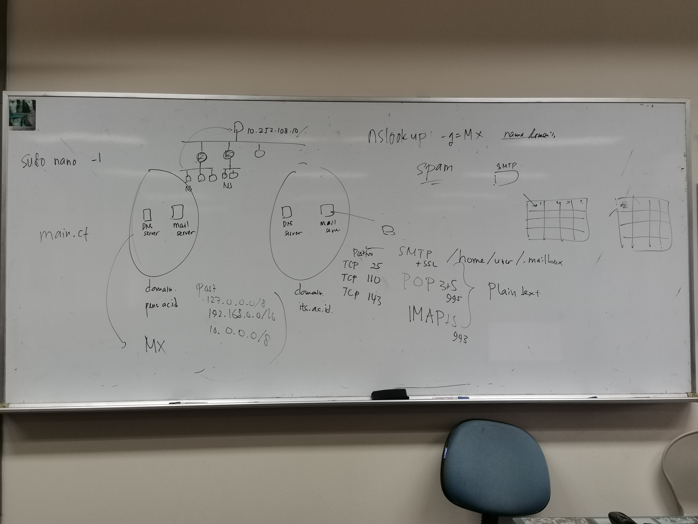
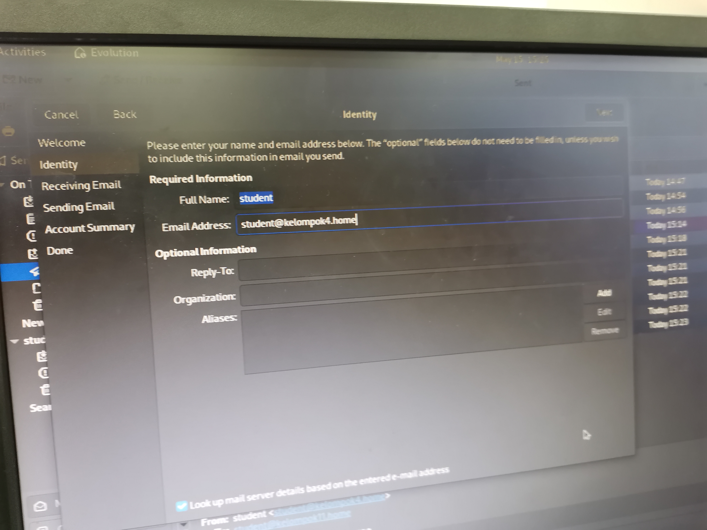
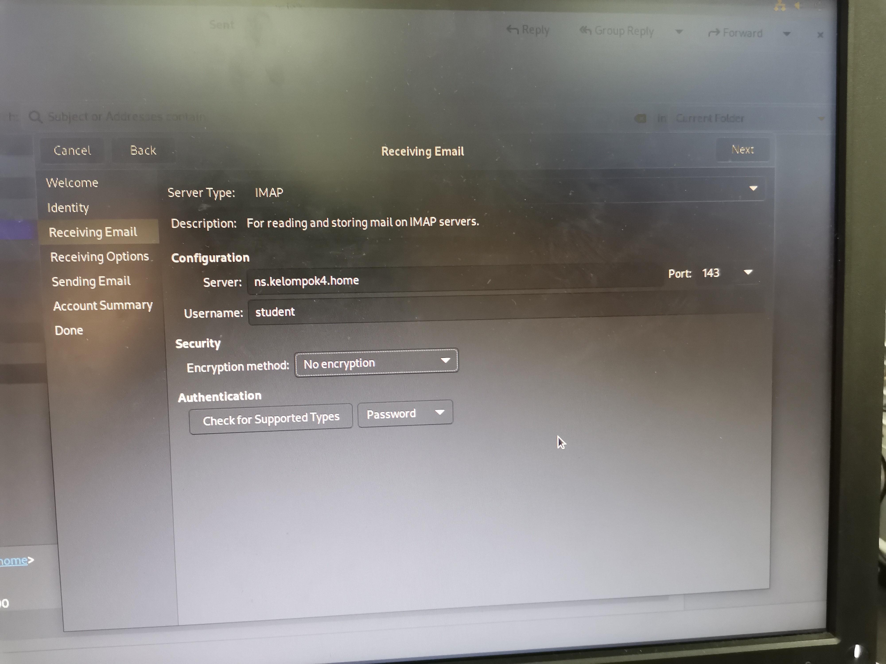
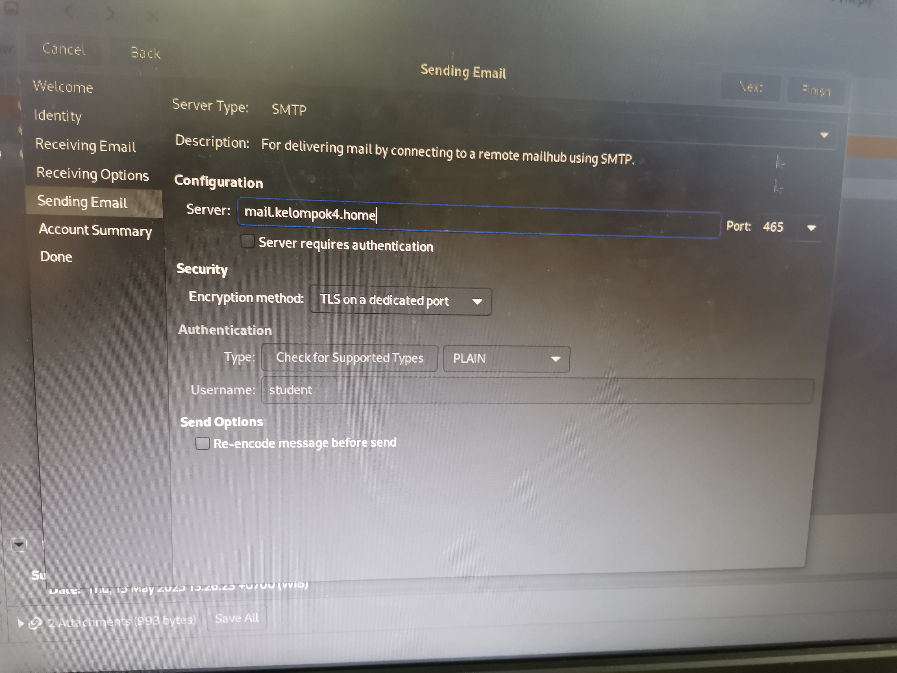
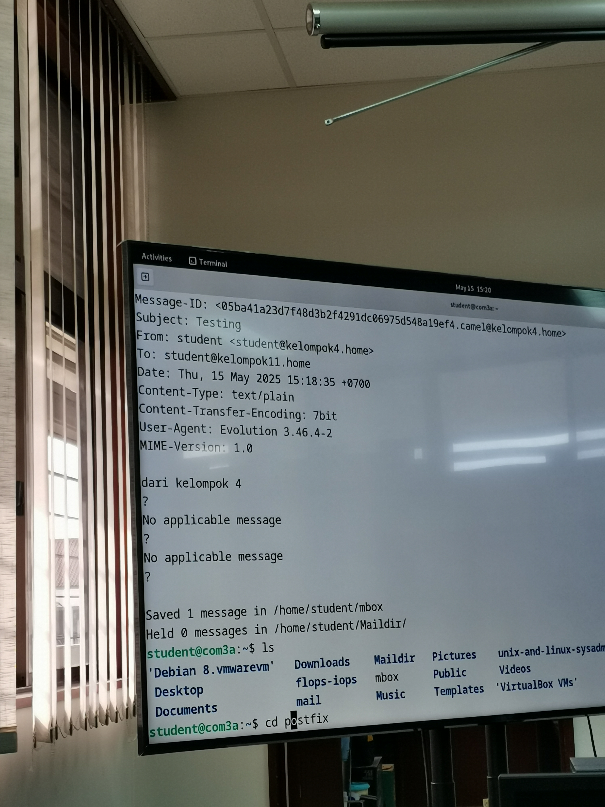
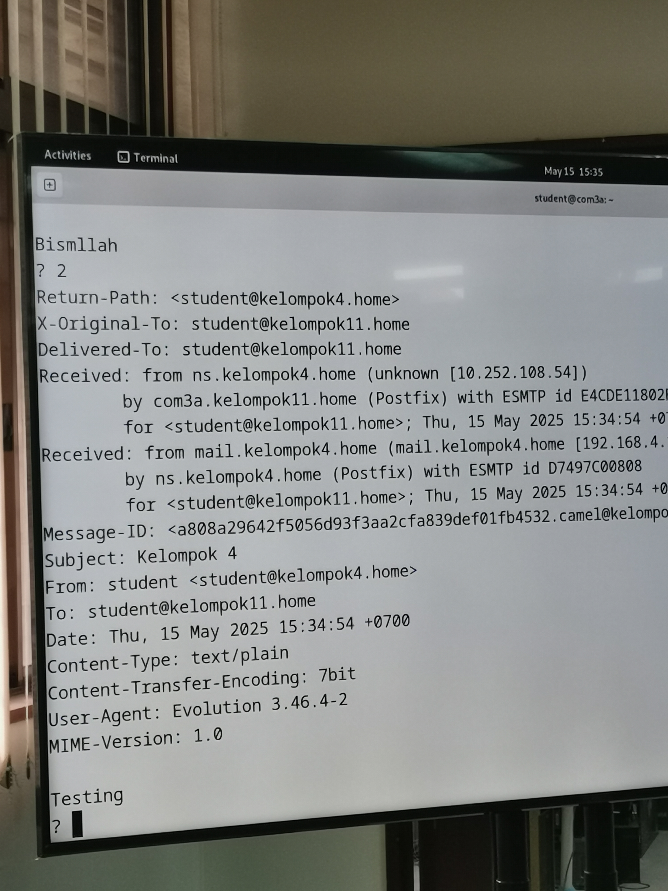

  <h1 style="text-align: center;font-weight: bold">Laporan Praktikum
   Workshop Administrasi Jaringan</h1>
  <h4 style="text-align: center;">Dosen Pengampu : Dr. Ferry Astika Saputra, S.T., M.Sc.</h4>

 

  
  <h3 style="text-align: center;">Disusun Oleh : </h3>
  

    <strong>Nama: Fauzan Abderrasheed</strong> 
    <strong>NRP: 3123500020 </strong> 
    <strong>Kelas: D3 IT A</strong>
  

<h3 style="text-align: center;line-height: 1.5">Politeknik Elektronika Negeri Surabaya Departemen Teknik Informatika Dan Komputer Program Studi Teknik Informatika 2023/2024</h3>
  

# Laporan Praktikum Mail Server

## Pendahuluan

Laporan praktikum mail server ini adalah percobaan untuk pengiriman email antar kelompok menggunakan terminal dan GNOME Evolution. GNOME Evolution sendiri adalah Personal Information Manager yang salah satu fungsinya adalah menyediakan fungsi terintergrasi untuk email. 
## Percobaan

Dalam praktikum week-11 sudah dicoba untuk mengirim email ke diri sendiri dan berhasil, percobaan pada praktikum kali ini adalah untuk mengirim email ke kelompok lain. 

### Konfigurasi Evolution

1. Konfigurasi Identitas untuk pembuatan akun evolution, yaitu dengan mengisikan full name dan email address yang sudah dibuat.
	
	
	
2. Konfigurasi server / name server untuk menerima email dari kelompok lain.
	
	
	
3. Konfigurasi server untuk mengirim email ke kelompok lain
	
	
	
### Konfigurasi Networks pada Postfix 

Pada postfix `main.cf` perlu mengubah mynetworks menjadi ip yang sudah ditentukan, pada praktikum ini yaitu adalah 
- 127.0.0.0/8
- 192.168.0.0/16
- 10.0.0.0/8

### Menambahkan hostname (domain) mail pada DNS

Untuk memastikan agar koneksi antar kelompok bisa berjalan dan proses pengiriman dan menerima email bisa terjadi, maka perlu ditambahkan hostname `mail` pada konfigurasi DNS untuk setiap kelompok. `mail` sendiri adalah nama host yang merujuk ke server email (mail server). 

Berdasarkan gambar di atas, pada baris `IN MX 10 ns.kelompok4.home.`, domain ini mengarahkan email ke server `ns.kelompok4.home`, tapi `mail` biasanya digunakan sebagai nama alias untuk layanan email.
- **IN**: Kelas record, biasanya `IN` (Internet).
- **MX**: Tipe record — artinya ini adalah Mail Exchange record, digunakan untuk mengatur **ke mana email untuk domain ini dikirim**.
- **10**: Ini adalah **prioritas** mail server. Angka ini disebut **priority value**, semakin kecil angkanya, semakin **tinggi prioritasnya**.
- **ns.kelompok4.home.**: Ini adalah **hostname dari mail server** yang menerima email untuk domain `kelompok4.home`.
Record ini memberi tahu bahwa **email yang dikirim ke `@kelompok4.home` akan diarahkan ke server `ns.kelompok4.home.` dengan prioritas 10**.

### Penambahan nameserver Master DNS 

Langkah selanjutnya adalah menambahkan nameserver ip dari Master DNS ke dalam `resolv.conf` agar bisa mengirimkan email ke kelompok lain.

### Percobaan mengirim email

Dalam gambar dibawah ini adalah hasil dari percobaan mengirim email menggunakan Evolution, percobaan pengiriman email ditargetkan ke email kelompok 11 yaitu master DNS dan berhasil (email sent)

Bukti dari berhasilnya email tersebut terkirim ada pada gambar di bawah ini, dimana email berhasil diterima dan dapat dibuka oleh PC kelompok 11

Percobaan dilakukan lagi untuk kedua kalinya dan masih berhasil, menandakan bahwa Praktikum Percobaan Mail Server sudah berhasil.

