<div align="center">
  <h1 class="text-align: center;font-weight: bold">Praktikum <br>Workshop Administrasi Jaringan</h1>
  <h3 class="text-align: center;">Dosen Pengampu : Dr. Ferry Astika Saputra, S.T., M.Sc.</h3>
</div>
<br />
<div align="center">
  
  <h3 style="text-align: center;">Disusun Oleh : </h3>
  <p style="text-align: center;">
    <strong>Dewangga Wahyu Putera Wangsa (3123500007)</strong><br>
  </p>

<h3 style="text-align: center;line-height: 1.5">Politeknik Elektronika Negeri Surabaya<br>Departemen Teknik Informatika Dan Komputer<br>Program Studi Teknik Informatika<br>2025/2026</h3>
  <hr><hr>
</div>

# Chapter 4: Process Control

## Table content

- [Komponen Proses](#komponen-proses)
- [PPID: nomor ID proses induk](#ppid-nomor-id-proses-induk)
- [UID dan EUID: ID pengguna dan ID pengguna yang efektif](#uid-dan-euid-id-pengguna-dan-id-pengguna-yang-efektif)
- [Lifecycle of a Process](#lifecycle-of-a-process)
- [Sinyal](#sinyal)
- [Kill: send signals](#kill-send-signals)
- [PS: Monitoring Processes](#ps-monitoring-processes)
- [Interactive monitoring with top](#interactive-monitoring-with-top)
- [Nice and renice: changing process priority](#nice-and-renice-changing-process-priority)
- [The /proc filesystem](#the-proc-filesystem)
- [Strace and truss](#strace-and-truss)
- [Runaway processes](#runaway-processes)
- [Periodic processes](#periodic-processes)
- [Format of crontab](#format-of-crontab)
- [Systemd timer](#systemd-timer)
- [Common use for scheduled tasks](#common-use-for-scheduled-tasks)
- [Kesimpulan](#kesimpulan)

### Komponen Proses

Proses adalah wadah yang berisi sumber daya yang dikelola kernel untuk menjalankan program. Komponennya mencakup **ruang alamat** berupa halaman memori (4KiB atau 8KiB) yang menyimpan kode, data, dan tumpukan proses. Kernel juga menggunakan **struktur data** untuk memantau status proses, prioritas, dan parameter penjadwalan. Selain itu, proses memiliki **deskriptor file** untuk file yang terbuka dan berbagai atribut yang menunjukkan keadaannya.

Setiap proses dicatat dalam struktur data internal kernel:

- Peta ruang alamat proses
- Status proses (berjalan, tidur, dll.)
- Prioritas proses
- Informasi tentang sumber daya yang digunakan proses (CPU, memori, dll.)
- File dan port jaringan yang dibuka oleh proses
- Pemilik proses (identifikasi pengguna pengguna yang memulai proses).

Thread memungkinkan **paralelisme dalam proses**, di mana satu proses dapat memiliki banyak thread yang berbagi ruang alamat dan sumber daya yang sama. Thread lebih ringan dibandingkan proses karena lebih murah untuk dibuat dan dihancurkan.

**Contoh:**

Server web menggunakan thread untuk menangani banyak permintaan secara bersamaan. Saat ada koneksi masuk, server web membuat thread baru untuk menangani permintaan tersebut. Meskipun setiap thread hanya menangani satu permintaan pada satu waktu, server secara keseluruhan dapat menangani banyak permintaan karena memiliki banyak thread.

### PPID: nomor ID proses induk

Setiap proses dikaitkan dengan proses induk yang membuatnya. Nomor ID proses induk, atau PPID, merujuk pada PID dari induk proses. Sistem menggunakan PPID untuk merujuk ke proses induk dalam berbagai panggilan sistem, misalnya, untuk mengirim sinyal ke proses induk..

### UID dan EUID: ID pengguna dan ID pengguna yang efektif

ID pengguna, atau UID, adalah ID pengguna dari pengguna yang memulai proses. ID pengguna efektif, atau EUID, adalah ID pengguna yang digunakan proses untuk menentukan sumber daya apa yang dapat diakses oleh proses. EUID digunakan untuk mengontrol akses ke file, port jaringan, dan sumber daya lainnya.

### **Lifecycle of a Process**

Proses baru dibuat melalui **panggilan sistem `fork`**, yang menyalin proses asli dengan **PID berbeda** dan informasi akuntansi sendiri.

Saat **booting**, kernel otomatis membuat beberapa proses, termasuk **init atau systemd** yang selalu menjadi **proses nomor 1**. Proses ini mengeksekusi skrip startup sistem, meskipun metode eksekusinya berbeda antara UNIX dan Linux. Semua proses, kecuali yang dibuat langsung oleh kernel, merupakan **turunan dari proses primordial ini**.

### Sinyal

Sinyal adalah cara untuk mengirim pemberitahuan ke suatu proses. Sinyal digunakan untuk memberi tahu suatu proses bahwa peristiwa tertentu telah terjadi.

Sekitar tiga puluh jenis yang berbeda didefinisikan, dan mereka digunakan dalam berbagai cara:

- Mereka dapat dikirim di antara proses sebagai sarana komunikasi.
- Mereka dapat dikirim oleh driver terminal untuk membunuh, menginterupsi, atau menangguhkan proses ketika tombol seperti dan ditekan.
- Mereka dapat dikirim oleh administrator (dengan kill) untuk mencapai berbagai tujuan.
- Mereka dapat dikirim oleh kernel ketika sebuah proses melakukan pelanggaran seperti pembagian dengan nol.
- Mereka dapat dikirim oleh kernel untuk memberitahukan sebuah proses tentang sebuah kondisi yang "menarik" seperti matinya sebuah proses anak atau tersedianya data pada sebuah saluran I/O.
    
    
    

Sinyal KILL, INT, TERM, HUP, dan QUIT terdengar seolah-olah memiliki arti yang kurang lebih sama, tetapi penggunaannya sebenarnya sangat berbeda.

- KILL tidak dapat diblokir dan menghentikan proses pada tingkat kernel. Sebuah proses tidak akan pernah benar-benar menerima atau menangani sinyal ini.
- Sinyal **INT** dikirim oleh driver terminal saat pengguna mengetik perintah tertentu untuk menghentikan operasi yang sedang berjalan. Program sederhana harus berhenti atau akan dihentikan secara paksa jika tidak menangkap sinyal ini. Program dengan antarmuka baris perintah, seperti shell, biasanya membersihkan statusnya dan menunggu masukan pengguna setelah menerima sinyal ini.
- TERM adalah permintaan untuk menghentikan eksekusi sepenuhnya. Diharapkan proses yang menerima akan membersihkan statusnya dan keluar.
- HUP dikirim ke sebuah proses ketika terminal pengendali ditutup. Awalnya digunakan untuk mengindikasikan "menutup" koneksi telepon, sekarang sering digunakan untuk menginstruksikan proses daemon untuk mengakhiri dan memulai ulang, sering kali untuk mempertimbangkan konfigurasi baru. Perilaku yang tepat tergantung pada proses spesifik yang menerima sinyal HUP.
- QUIT mirip dengan TERM, kecuali bahwa ia secara default menghasilkan core dump jika tidak tertangkap. Beberapa program mengkanibalisasi sinyal ini dan menafsirkannya sebagai sesuatu yang lain.

### **Kill: send signals**

Seperti namanya, perintah kill paling sering digunakan untuk menghentikan sebuah proses. Kill dapat mengirimkan sinyal apa pun, tetapi secara default ia mengirimkan TERM. Kill dapat digunakan oleh pengguna biasa pada proses mereka sendiri atau oleh root pada proses apa pun.  Syntaxnya seperti berikut:

```bash
kill [-signal] pid
```

di mana pid adalah nomor identifikasi proses dari proses target, dan signal adalah nomor atau nama simbolik dari sinyal yang akan dikirim.

Karena sinyal TERM dapat ditangkap, diblokir, atau diabaikan, perintah kill -9 pid dijamin akan membunuh proses karena sinyal KILL tidak dapat ditangkap, diblokir, atau diabaikan.

Killall membunuh proses hanya berdasarkan namanya, bukan nomor identifikasinya.  Tidak semua sistem dapat menggunakan perintah ini.  Contohnya:

```bash
killall firefox
```

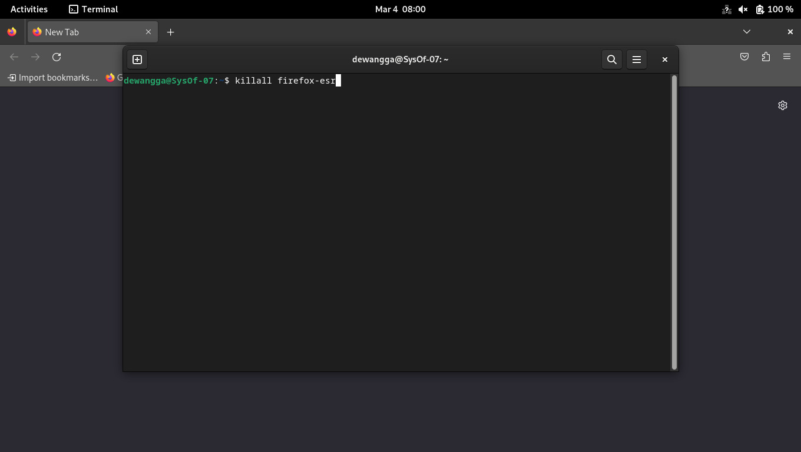

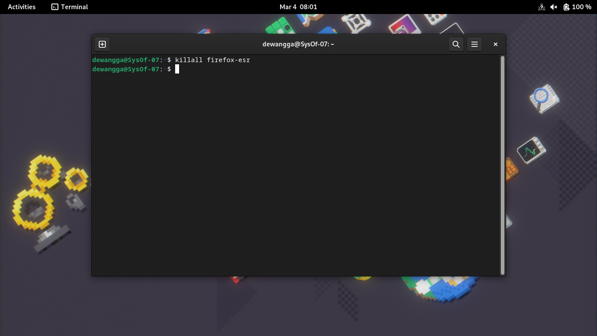

Perintah killall mirip dengan perintah pkill, tetapi memiliki lebih banyak opsi.

contoh:

```bash
pkill -u abdoufermat # kill all processes owned by user abdoufermat
```

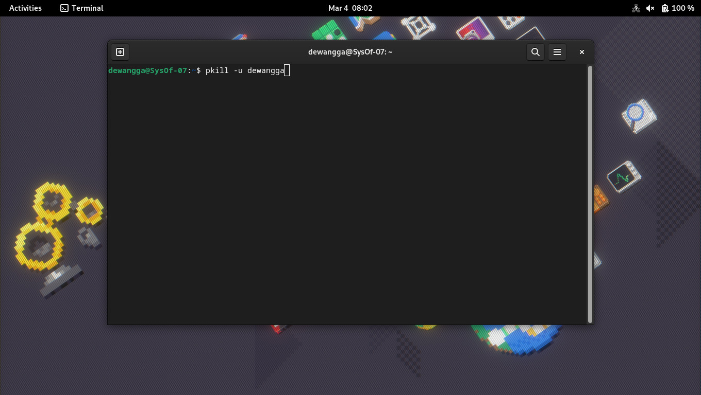

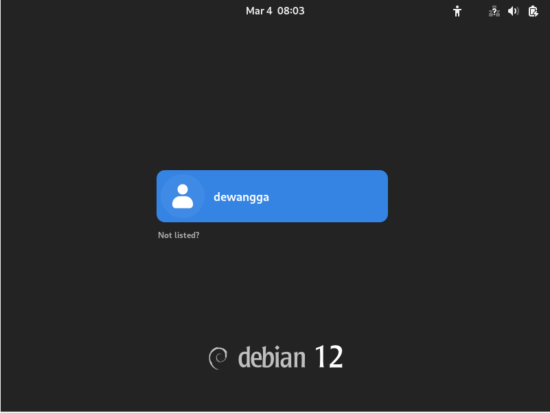

### **PS: Monitoring Processes**

Alat utama yang digunakan administrator sistem untuk memantau proses adalah perintah ps.  Meskipun argumen dan tampilan versi PS berbeda, informasinya sama.

PID, UID, prioritas, dan terminal kontrol proses dapat ditampilkan oleh ps.  Selain itu, ia menunjukkan jumlah memori yang digunakan proses, waktu CPU yang digunakan, dan status proses saat ini (berjalan, berhenti, tidur, dll.).

Dengan menjalankan ps aux, Anda dapat melihat gambaran umum sistem. Opsi a meminta ps untuk menampilkan proses dari semua pengguna, dan opsi u meminta ps untuk memberikan informasi rinci tentang setiap proses. Opsi x meminta ps untuk menampilkan proses yang tidak berhubungan dengan terminal.

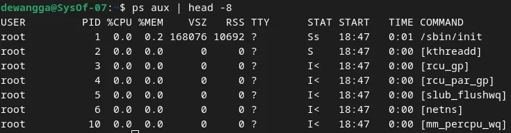

Dengan menggunakan perintah "ps aux | head -8", Anda akan melihat semua proses yang sedang berjalan dengan informasi lengkap. Namun, hasilnya dibatasi hanya pada delapan baris pertama.


Lax, yang menyediakan informasi teknis tentang proses, sedikit lebih cepat daripada aux karena tidak perlu menyelesaikan nama pengguna dan grup.

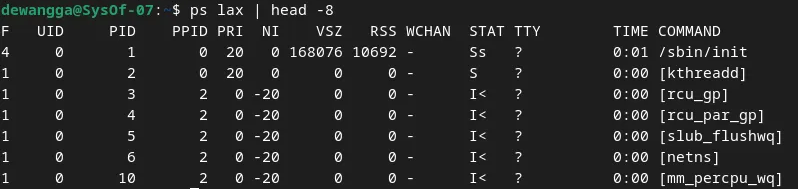

Anda dapat memfilter output ps dengan grep untuk mencari proses tertentu.

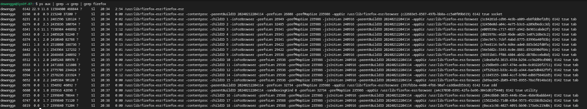

Perintah "ps aux | grep -v grep | grep firefox" menampilkan proses yang mengandung kata "firefox" dalam daftar proses yang sedang berjalan, tetapi mengabaikan baris yang mengandung perintah "grep" sendiri.

Kita dapat menentukan PID dari sebuah proses dengan menggunakan pgrep.

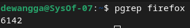

or **pidof**.

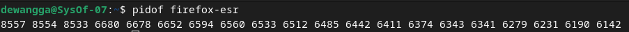

### **Interactive monitoring with top**

Perintah "top" menampilkan tampilan sistem yang sedang berjalan dalam waktu nyata yang menampilkan ringkasan sistem dan daftar proses atau thread yang dikelola kernel Linux. Tampilan ini otomatis diperbarui setiap 1-2 detik. Setelah restart, pengguna dapat mengubah tampilan dan mempertahankan konfigurasi tersebut. Namun, perintah "htop" adalah penampil proses interaktif yang lebih canggih. Ini memiliki kemampuan menggulir secara vertikal dan horizontal, tampilan antarmuka yang lebih baik, dan lebih banyak opsi operasi daripada perintah "top".

### **Nice and renice: changing process priority**

Nilai kebaikan adalah nilai numerik yang memberi tahu kernel tentang prioritas suatu proses dalam persaingan penggunaan CPU. Nilai tinggi (+19) menunjukkan prioritas rendah (bersikap "baik"), sedangkan nilai rendah atau negatif (-20) menunjukkan prioritas tinggi.  Kisaran niceness FreeBSD adalah -20 hingga +20, sedangkan Linux adalah -20 hingga +19.

Proses prioritas tinggi membutuhkan lebih banyak waktu CPU daripada proses prioritas rendah. Jika tugas intensif CPU dijalankan di latar belakang, nilai niceness tinggi akan mencegahnya mengganggu proses lain yang lebih penting.

Perintah nice digunakan untuk memulai proses dengan nilai kebaikan tertentu. Sintaksnya adalah:

```bash
nice -n nice_val [command]
```

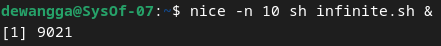

Dengan menggunakan perintah "nice -n 10 sh [infinite.sh](http://infinite.sh/)", skrip "[infinite.sh](http://infinite.sh/)" dijalankan di latar belakang dengan prioritas CPU yang lebih rendah. Ini menunjukkan bahwa proses ini memiliki prioritas CPU yang lebih rendah daripada proses lain dengan niceness yang lebih rendah atau negatif.

Perintah renice digunakan untuk mengubah nilai kebaikan dari proses yang sedang berjalan. Sintaksnya adalah:

```bash
renice -n nice_val -p pid
```

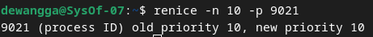

Nilai "kebersihan" proses dengan PID 9021 diubah menjadi "10" dengan perintah "renice -n 10 -p 9021". Ini menurunkan prioritas CPU proses jika dibandingkan dengan proses lain dengan nilai kebersihannya lebih rendah atau negatif.

Nilai prioritas dalam Linux berkisar dari **0 hingga 139**, dengan **0-99 untuk proses real-time** dan **100-139 untuk proses pengguna**. Hubungannya dengan **niceness** adalah:

> priority_value = 20 + nice_value
> 

Default **niceness** adalah **0**, dan semakin rendah nilainya, semakin tinggi prioritas proses.

### **The /proc filesystem**

Kernel Linux menggunakan direktori "/proc" sebagai sistem berkas semu untuk menampilkan informasi tentang "status sistem dan proses yang sedang berjalan". Setiap proses memiliki direktori yang diberi nama berdasarkan PID-nya, yang berisi berbagai berkas yang berisi informasi seperti "baris perintah, variabel lingkungan, dan deskriptor berkas." Perintah seperti "ps" dan "top" membaca data dari direktori.


### **Strace and truss**

Di Linux dan FreeBSD, perintah strace melacak panggilan sistem dan sinyal proses, yang bermanfaat untuk debugging atau memahami perilaku program.

Untuk melacak proses top dengan PID 5810, misalnya, jalankan:

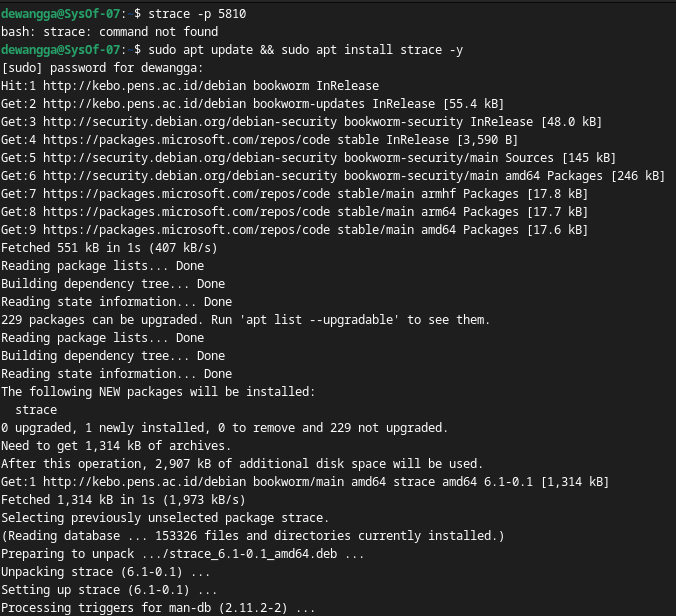

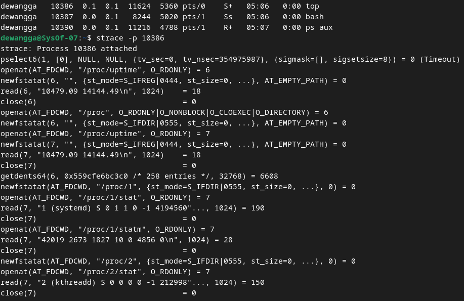

top dimulai dengan memeriksa waktu saat ini. Selanjutnya, membuka dan membuat statistik direktori /proc, dan membaca file /proc/1/stat untuk mendapatkan informasi tentang proses init.

### **Runaway processes**

Terkadang, proses berhenti merespons sistem dan berjalan liar. Proses ini mengabaikan prioritas penjadwalan mereka dan berusaha menggunakan CPU sepenuhnya, yang menyebabkan mesin menjadi sangat lambat.  Ini dikenal sebagai proses yang kabur.

Anda dapat menghentikan proses yang kabur dengan perintah kill jika proses tidak menanggapi sinyal TERM.

```bash
kill -9 pid

or

kill -KILL pid
```

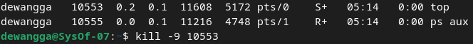

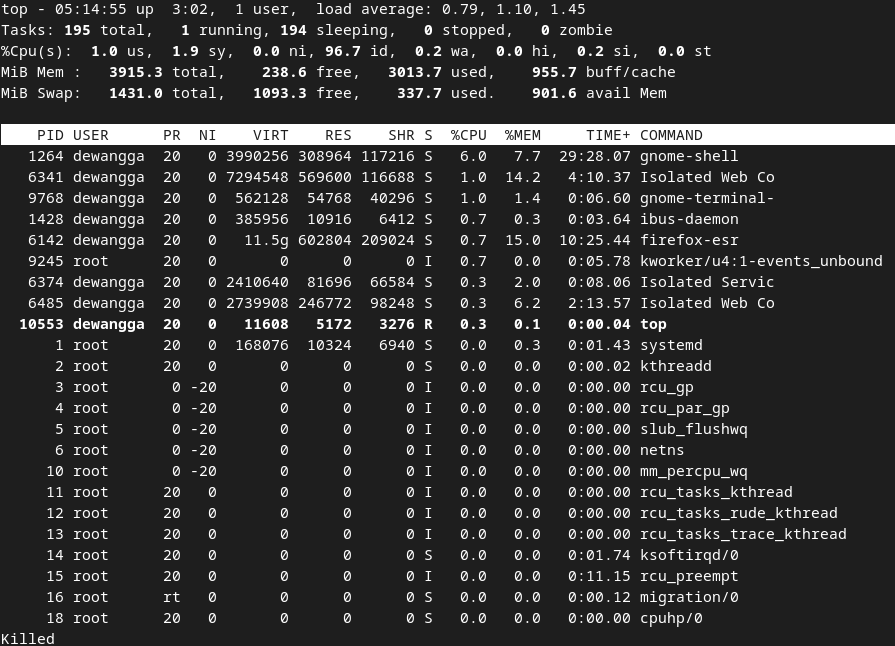

Untuk menyelidiki "proses runaway", gunakan "strace" untuk melacak aktivitasnya, "df -h" untuk mengecek penggunaan disk, "du" untuk menemukan berkas terbesar, dan "lsof" untuk melihat file yang dibuka oleh proses.

```bash
lsof -p pid
```

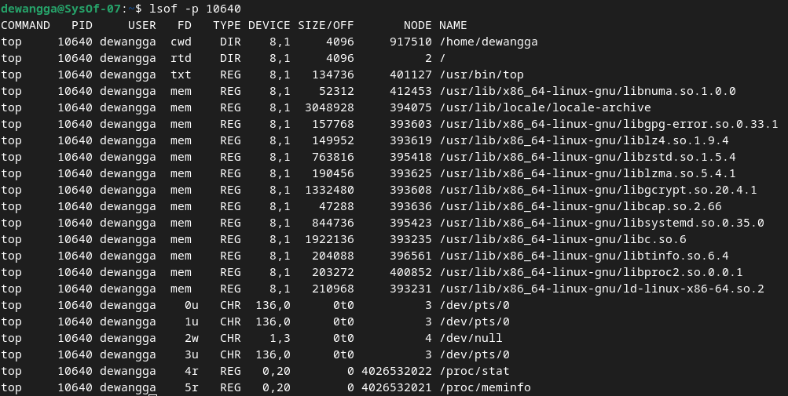

Perintah `lsof -p PID` menampilkan daftar semua file yang sedang dibuka oleh proses dengan **PID** tertentu, termasuk file biasa, socket, dan pipe.

### **Periodic processes**

**cron: schedule command**

Cron adalah daemon penjadwalan tugas Linux yang berjalan terus-menerus sejak booting dan membaca konfigurasi crontab untuk mengeksekusi perintah secara otomatis pada titik tertentu. Untuk Linux dan FreeBSD, crontab pengguna disimpan di /var/spool/cron atau /var/cron/tabs.

### **Format of crontab**

File crontab memiliki lima bidang untuk menentukan hari, tanggal dan waktu yang diikuti dengan perintah yang akan dijalankan pada interval tersebut.

```bash
*     *     *     *     *  command to be executed
-     -     -     -     -
|     |     |     |     |
|     |     |     |     +----- day of week (0 - 6) (Sunday=0)
|     |     |     +------- month (1 - 12)
|     |     +--------- day of month (1 - 31)
|     +----------- hour (0 - 23)
+------------- min (0 - 59)
```

Contoh: 

```bash
# Run a command at 2:30am every day
30 2 * * * command

# Run a command at 10:30pm on the 1st of every month
30 22 1 * * command

# Run a Python script every 1st of the month at 2:30am
30 2 1 * * /usr/bin/python3 /path/to/script.py
```

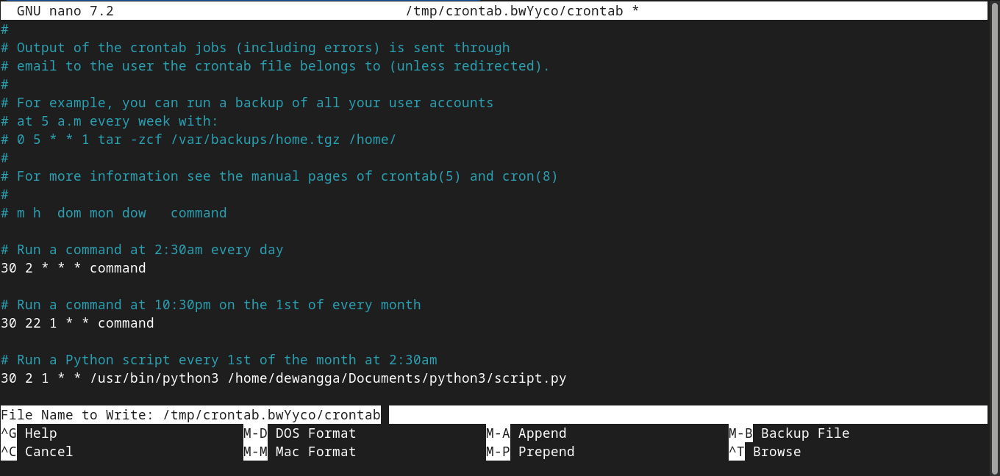

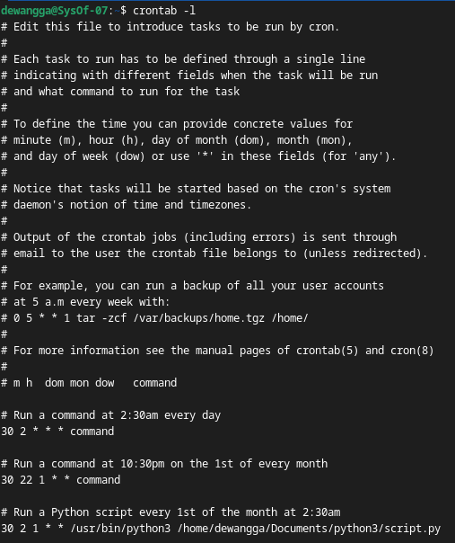

Berikut jadwalnya: 0,30 * 13 * 5 berarti bahwa perintah akan dijalankan pada 0 dan 30 menit setelah jam ke-13 pada hari Jumat. Jika Anda ingin menjalankan perintah setiap 30 menit, Anda dapat menggunakan jadwal berikut: */30 * * * *.

### **Systemd timer**

**Systemd timer** adalah alternatif yang lebih fleksibel dan kuat dibandingkan **cron** untuk menjadwalkan tugas di Linux. Unit **`.timer`** mengaktifkan unit layanan **`.service`** pada waktu yang ditentukan. Timer dapat dijalankan saat boot atau berdasarkan peristiwa tertentu. Untuk melihat timer yang aktif, gunakan perintah:

```bash
systemctl list-timers
```

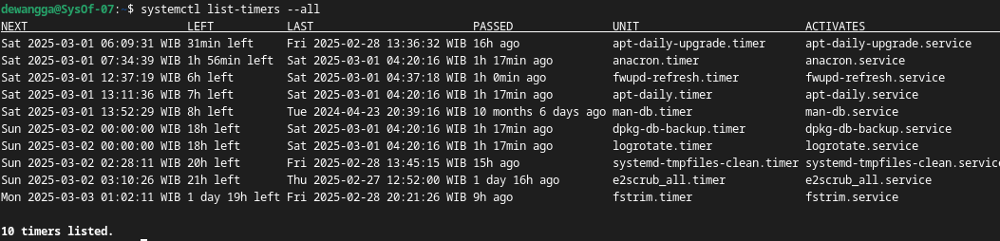

Pada contoh di atas, unit logrotate.timer dijadwalkan untuk mengaktifkan unit logrotate.service pada tengah malam setiap hari.

Berikut ini adalah tampilan unit logrotate.timer:

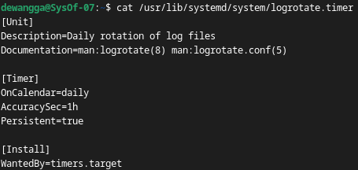

Opsi OnCalendar digunakan untuk menentukan kapan timer harus mengaktifkan layanan. Opsi AccuracySec digunakan untuk menentukan akurasi pengatur waktu. Opsi Persistent digunakan untuk menentukan apakah timer harus mengejar waktu yang terlewat.

### **Common use for scheduled tasks**

**Mengirim email**

Anda dapat secara otomatis mengirim email output laporan harian atau hasil eksekusi perintah menggunakan pengatur waktu cron atau systemd.

Sebagai contoh:

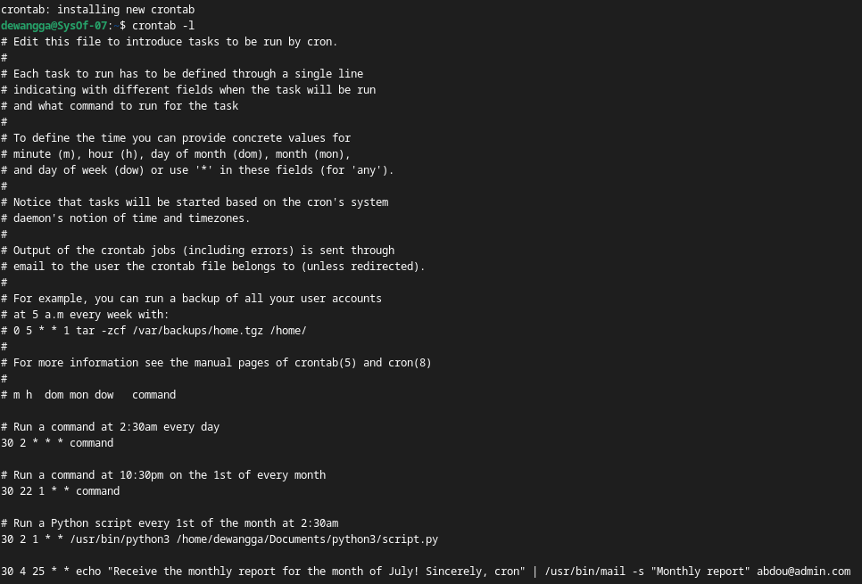

**Cleaning up a filesystem**

Anda dapat menjalankan skrip yang membersihkan sistem berkas dengan menggunakan pengatur waktu cron atau systemd. Sebagai contoh, Anda dapat menjalankan skrip untuk membersihkan isi direktori sampah setiap hari pada tengah malam.

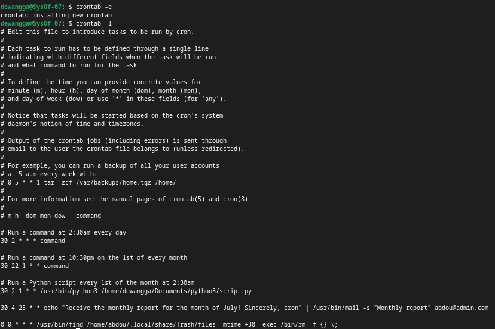

Membersihkan file lama di Trash (>30 hari) secara otomatis setiap tengah malam.

**Rotasi File Log** 

Ini membagi file log berdasarkan ukuran atau tanggal agar log lama tetap tersedia, dan proses ini dijadwalkan secara otomatis.

**Menjalankan Pekerjaan Batch**

Pekerjaan batch seperti pemrosesan pesan dalam antrean atau pekerjaan ETL dapat dijadwalkan dengan menggunakan cron untuk efisiensi.

**Mencadangkan dan Memproyeksikan**

Tugas terjadwal dapat digunakan untuk backup otomatis ke sistem jarak jauh atau memproyeksikan menggunakan rsync agar data selalu diperbarui.

### Kesimpulan

Kontrol proses sistem operasi mencakup unsur-unsur proses seperti ruang alamat, status, prioritas, dan sumber daya yang digunakan.  Setiap proses memiliki PPID (proses induk), UID, dan EUID, yang mengatur hak aksesnya.  Siklus hidup proses dimulai dengan inisialisasi sistem dengan "init" atau "systemd" dan berlanjut hingga penghentian dengan sinyal seperti KILL, TERM, dan HUP. Perintah "ps", "top", dan "htop" dapat digunakan untuk memantau proses, dan perintah "nice" dan "renice" dapat digunakan untuk mengelola prioritas.  Dalam sistem berkas virtual, "/proc" menyimpan data proses yang berjalan, dan "strace" membantu melacak panggilan sistem untuk debugging.
