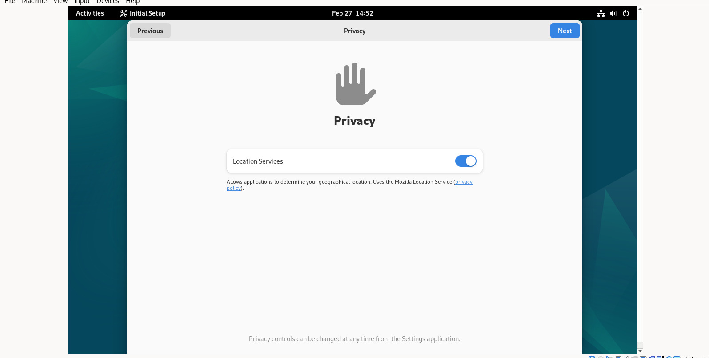

<div align="center">
  <h1 class="text-align: center;font-weight: bold">Praktikum <br>Workshop Administrasi Jaringan</h1>
  <h3 class="text-align: center;">Dosen Pengampu : Dr. Ferry Astika Saputra, S.T., M.Sc.</h3>
</div>
<br />
<div align="center">
  
  <h3 style="text-align: center;">Disusun Oleh : </h3>
  <p style="text-align: center;">
    <strong>Dewangga Wahyu Putera Wangsa (3123500007)</strong><br>
  </p>

<h3 style="text-align: center;line-height: 1.5">Politeknik Elektronika Negeri Surabaya<br>Departemen Teknik Informatika Dan Komputer<br>Program Studi Teknik Informatika<br>2025/2026</h3>
  <hr><hr>
</div>

## Install Debian di komputer lab

## Table content

- [Solve LAN Wired Not Connected](#solve-lan-wired-not-connected)
- [IP Komputer Lab](#ip-komputer-lab)
- [Clone Github](#clone-github)
- [Download Virtual Box](#download-virtual-box)
- [Download ISO Debian 12](#download-iso-debian-12)
- [Install VirtualBox](#install-virtualbox)
- [Setelah proses instalasi, buka aplikasi virtualbox](#setelah-proses-instalasi-buka-aplikasi-virtualbox)
- [New Virtual Machine](#new-virtual-machine)

### Solve LAN Wired Not Connected


```bash
sudo dhclient -v
```

Perintah `sudo dhclient -v` digunakan untuk meminta atau memperbarui alamat IP dari server DHCP dengan menampilkan output secara rinci.

### IP Komputer Lab


Setelah Berhasil connect dengan LAN maka komputer akan mendapatkan ip address

### Clone Github

Install git di komputer lab


```bash
sudo apt install git
```

clone with git clone 


```bash
git clone https://github.com/ferryastika/unix-and-linux-sysadmin-notes.git
```

Cek OS 


```bash
lsb_release -a
```

### Download Virtual Box


https://www.virtualbox.org/wiki/Linux_Downloads

### Download ISO Debian 12


https://www.debian.org/download

### Install VirtualBox


```bash
sudo dpkg -i virtualbox-7.1_7.1.6-167084~Debian~bookworm_amd64.deb
```

### Setelah proses instalasi, buka aplikasi virtualbox

akan muncul error seperti gambar dibawah ini:


Solve menggunakan perintah :

```bash
sudo usermod -a -G vboxusers $USERS
```

Perintah ini menambahkan pengguna yang sedang login ke dalam grup `vboxusers`, yang biasanya diperlukan agar bisa mengakses fitur tertentu di VirtualBox, seperti USB passthrough.

### New Virtual Machine

Sesuaikan Name dan Operating System seperti gambar dibawah ini


Sesuaikan Unattended Install seperti gambar dibawah ini


Sesuaikan Hardware seperti gambar dibawah ini


Sesuaikan Hard Disk seperti gambar dibawah ini


Langkah selanjutnya klik finish dan tunggu loading hingga selesai 


Jika sudah seperti gambar dibawah ini bisa dipastikan install debian 12 telah berhasil


Selanjutnya klik next next hingga done





