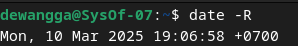

## **Konfigurasi Network Time Protocol (NTP)**

NTP Client adalah perangkat lunak yang berfungsi untuk menyinkronkan waktu sistem dengan server waktu menggunakan protokol NTP. Protokol ini memungkinkan komputer di jaringan untuk menyesuaikan jam dengan tingkat akurasi tinggi, biasanya hingga milidetik.

## NTPSec

NTP Secure (NTPsec) adalah versi yang telah diperkuat dari NTP, dirancang untuk menutup celah keamanan dan meningkatkan kestabilan. Berikut adalah langkah-langkah konfigurasinya.

### A. Instalasi NTP Client

1. Install dan konfigurasi NTP client agar host anda mempunyai Waktu yang sinkron dengan NTP server di Indonesia
    
    
    
2. Cek waktu berdasarkan lokasi saya
    
    
    
3. nama NTP server yang harus dirujuk adalah ntp server Indonesia
    
    
    
    Selanjutnya restart seperti gambar dibawah ini:
    
    
    

### B. Instalasi dan konfigurasi Samba

1. Membuat public shared folder
    
    Install samba
    
    
    
    ```bash
    mkdir /home/share
    ```
    
    Membuat direktori `/home/share` sebagai folder berbagi.
    
    ```bash
    chmod 777 /home/share
    ```
    
    Memberikan izin penuh (read, write, execute) kepada semua pengguna.
    
    ```bash
    vi /etc/samba/smb.conf
    ```
    
    Membuka file konfigurasi Samba untuk diedit.
    
    Selanjutnya lakukan konfigurasi seperti gambar di bawah ini:
    
    
    
    ```bash
    unix charset = UTF-8 
    ```
    
    untuk mengatur encoding karakter menjadi UTF-8 untuk mendukung karakter khusus.
    
    ```bash
    interfaces = 127.0.0.0/8 10.0.0.0/24
    ```
    
    Membatasi akses Samba hanya untuk localhost dan jaringan 10.0.0.0/24.
    
    ```bash
    map to guest = bad user
    ```
    
    Mengalihkan pengguna tidak dikenal ke akun guest secara otomatis.
    
    
    
    ```bash
    [Share]
    ```
    
    Menentukan nama share yang akan digunakan.
    
    ```bash
    path = /home/share
    ```
    
    Menentukan direktori yang akan dibagikan melalui Samba.
    
    ```bash
    writable = yes
    ```
    
    Mengizinkan pengguna untuk menulis dan mengedit file dalam share ini.
    
    ```bash
    guest ok = yes
    ```
    
    Mengizinkan akses tamu tanpa autentikasi.
    
    ```bash
    guest only = yes
    ```
    
    Memaksa semua pengguna yang terhubung sebagai guest.
    
    ```bash
    force create mode = 777
    ```
    
    Mengatur izin semua file yang dibuat agar dapat diakses oleh semua pengguna.
    
    ```bash
    force directory mode = 777
    ```
    
    Mengatur izin semua folder yang dibuat agar dapat diakses oleh semua pengguna.
    
    ```bash
    systemctl restart smbd
    ```
    
    Me-restart layanan Samba agar perubahan konfigurasi diterapkan.
    
    
    
    Setelah direstart, ketik `systemctl status smbd` untuk cek status dari samba aktif apa belum.
    
    Akses menggunakan Window Client:
    
    
    
    Akses menggunakan Debian Client:
    
    
    
2. Membuat limited shared Folder
    
    ```bash
    groupadd wangsagroup01
    ```
    
    Membuat grup baru bernama wangsa**group01** untuk mengelola akses Samba.
    
    ```bash
    mkdir /home/share01
    ```
    
    Membuat direktori **/home/share01** sebagai folder berbagi.
    
    ```bash
    chgrp wangsagroup01 /home/share01
    ```
    
    Mengubah grup kepemilikan direktori menjadi wangsa**group01**.
    
    ```bash
    chmod 770 /home/share01
    ```
    
    Mengatur izin agar hanya pemilik dan anggota grup wangsa**group01** yang bisa mengaksesnya.
    
    ```bash
    vi /etc/samba/smb.conf
    ```
    
    Membuka file konfigurasi Samba untuk diedit.
    
    
    
    ```bash
    unix charset = UTF-8 
    ```
    
    untuk mengatur encoding karakter menjadi UTF-8 untuk mendukung karakter khusus.
    
    ```bash
    interfaces = 127.0.0.0/8 10.0.0.0/24
    ```
    
    Membatasi akses Samba hanya untuk localhost dan jaringan 10.0.0.0/24.
    
    
    
    ```bash
    [Share01]
    ```
    
    Menentukan nama share baru sebagai **Share01**.
    
    ```bash
    security = user
    ```
    
    Mengaktifkan autentikasi berbasis pengguna.
    
    ```bash
    path = /home/share01
    ```
    
    Menentukan direktori **/home/share01** sebagai folder berbagi
    
    ```bash
    writable = yes
    ```
    
    Mengizinkan pengguna untuk menulis dan mengedit file dalam share ini
    
    ```bash
    guest ok = no
    ```
    
    Menolak akses tamu, hanya pengguna terdaftar yang bisa masuk.
    
    ```bash
    valid users = @wangsagroup01
    ```
    
    Hanya anggota grup wangsa**group01** yang dapat mengakses share ini.
    
    ```bash
    force group = wangsagroup01
    ```
    
    Secara otomatis menetapkan grup file yang dibuat sebagai wangsa**group01**.
    
    ```bash
    force create mode = 770
    ```
    
    Mengatur izin file yang dibuat agar bisa diakses hanya oleh pemilik dan grup.
    
    ```bash
    force directory mode = 770
    ```
    
    Mengatur izin folder yang dibuat agar bisa diakses hanya oleh pemilik dan grup.
    
    ```bash
    inherit permissions = yes
    ```
    
    Membuat file dan folder baru mewarisi izin dari direktori induk.
    
    ```bash
    systemctl restart smbd
    ```
    
    Me-restart layanan Samba agar perubahan konfigurasi diterapkan.
    
    ```bash
    adduser dewangga
    ```
    
    Membuat akun pengguna **dewangga** di sistem.
    
    
    
    smbpasswd -a debian
    
    Menambahkan pengguna **dewangga** ke Samba dan mengatur kata sandinya.
    
    
    
    ```bash
    usermod -aG wangsagroup01 debian
    ```
    
    Menambahkan pengguna **dewangga** ke grup **wangsagroup01** agar bisa mengakses **Share01**.
    
    Akses menggunakan Window Client dan login dengan user yang telah ditentukan:
    
    
    
    
    
    Akses menggunakan Debian Client dan login dengan user yang telah ditentukan:
    
    
    
    
    
3. akses ke folder Share dari CLI client


### C. Buat rangkuman tentanag package management.

**Advanced Package Tool (APT)**

**Manajemen paket di Linux** adalah proses menginstal, memperbarui, menghapus, dan mengelola perangkat lunak menggunakan sistem manajemen paket (Package Management System). Sistem ini memungkinkan pengguna untuk mengelola perangkat lunak dengan lebih efisien melalui repositori resmi yang berisi berbagai paket aplikasi. Dengan manajemen paket, pengguna dapat dengan mudah menjaga sistem tetap terupdate, mengelola dependensi, serta memastikan keamanan perangkat lunak yang digunakan.

- **Perintah 'User' untuk Mencari dan Menampilkan Informasi**
    
    Perintah-perintah ini dapat dijalankan oleh pengguna biasa, karena tidak akan memengaruhi sistem Anda.
    
    | **Perintah** | **Deskripsi** |
    | --- | --- |
    | `apt show foo` | Menampilkan informasi tentang paket **foo** |
    | `apt search foo` | Mencari paket yang sesuai dengan **foo** |
    | `apt-cache policy foo` | Menampilkan versi yang tersedia dari **foo** |
- **Perintah Mode ‘Administrator’ untuk Pemeliharaan Sistem**
    
    Perintah-perintah ini harus dijalankan dengan hak administrator "root" karena dapat memengaruhi sistem.
    
    Untuk masuk ke mode administrator dari terminal, ketik **`su -`** lalu masukkan kata sandi administrator.
    
    ### **Perintah Dasar**
    
    | **Perintah** | **Deskripsi** |
    | --- | --- |
    | `apt update` | Memperbarui metadata repositori |
    | `apt install foo` | Menginstal paket **foo** beserta dependensinya |
    | `apt upgrade` | Memperbarui paket yang terinstal dengan aman |
    
    ---
    
    ### **Perintah Lanjutan**
    
    | **Perintah** | **Deskripsi** |
    | --- | --- |
    | `apt full-upgrade` | Memperbarui paket yang terinstal dengan menambah/menghapus paket lain jika diperlukan |
    | `apt remove foo` | Menghapus paket **foo**, tetapi tidak menghapus file konfigurasi |
    | `apt autoremove` | Menghapus paket yang tidak diperlukan secara otomatis |
    | `apt purge foo` | Menghapus paket **foo** beserta file konfigurasinya |
    | `apt clean` | Membersihkan cache lokal dari paket yang diinstal |
    | `apt autoclean` | Membersihkan cache lokal dari paket yang sudah usang |
    | `apt-mark showmanual` | Menandai paket sebagai "diinstal secara manual" |

**Software (Simplified Package Manager)**

Software (Simplified Package Manager) adalah alat manajemen paket yang dirancang untuk memudahkan pengguna dalam menginstal, memperbarui, dan menghapus aplikasi di sistem operasi berbasis Linux, seperti Debian dan Ubuntu. Berbeda dengan manajer paket berbasis terminal seperti APT, Software menyediakan antarmuka grafis yang lebih intuitif, memungkinkan pengguna untuk mencari dan mengelola aplikasi tanpa perlu mengetik perintah di terminal. Manajer paket ini sering digunakan oleh pengguna yang menginginkan kemudahan dalam mengelola perangkat lunak tanpa harus memahami detail teknis dari sistem manajemen paket yang lebih kompleks.


**Discover: KDE Package Manager**

Discover: KDE Package Manager adalah alat manajemen paket berbasis GUI yang dikembangkan untuk lingkungan desktop KDE Plasma. Discover memungkinkan pengguna untuk mencari, menginstal, memperbarui, dan menghapus aplikasi serta ekstensi dengan antarmuka yang ramah pengguna. Selain mendukung berbagai format paket seperti DEB, RPM, Flatpak, dan Snap, Discover juga dapat mengelola pembaruan sistem secara langsung. Dengan desain yang sederhana dan integrasi yang baik dengan ekosistem KDE, Discover menjadi pilihan ideal bagi pengguna yang menginginkan kemudahan dalam mengelola perangkat lunak tanpa harus menggunakan perintah terminal.


**Synaptic: Comprehensive Package Manager** 

Synaptic: Comprehensive Package Manager ****adalah alat manajemen paket berbasis GUI yang dirancang untuk sistem berbasis Debian, seperti Ubuntu. Synaptic memberikan kontrol penuh atas instalasi, pembaruan, dan penghapusan paket dengan antarmuka yang lebih mendalam dibandingkan dengan manajer paket sederhana. Pengguna dapat melihat daftar lengkap paket yang tersedia, menyaring berdasarkan kategori, serta melihat dependensi dan file terkait sebelum melakukan perubahan. Dengan fitur pencarian yang kuat dan dukungan untuk berbagai konfigurasi sistem, Synaptic menjadi pilihan ideal bagi pengguna yang menginginkan fleksibilitas dan kendali penuh atas perangkat lunak mereka tanpa harus menggunakan terminal.


**GDebi** 


GDebi adalah alat manajemen paket yang digunakan untuk menginstal paket **.deb** di sistem berbasis Debian dan Ubuntu. Dibandingkan dengan **dpkg**, GDebi memiliki keunggulan dalam menangani dependensi secara otomatis, sehingga memastikan semua pustaka dan paket tambahan yang dibutuhkan juga terinstal. GDebi tersedia dalam versi antarmuka grafis (GUI) maupun mode terminal (CLI), memungkinkan pengguna untuk menginstal paket dengan mudah dan efisien tanpa harus mencari dan menginstal dependensi secara manual.

**DPKG**

Dpkg adalah manajer paket dasar untuk sistem berbasis Debian yang digunakan untuk menginstal, menghapus, dan mengelola paket **.deb** secara langsung. Berbeda dengan **APT**, **dpkg** tidak menangani dependensi secara otomatis, sehingga pengguna harus menginstal paket tambahan yang diperlukan secara manual. **Dpkg** biasanya digunakan dalam mode terminal dan menjadi komponen inti dalam sistem manajemen paket Debian, memungkinkan pengguna untuk mengelola perangkat lunak tanpa perlu koneksi ke repositori daring.
