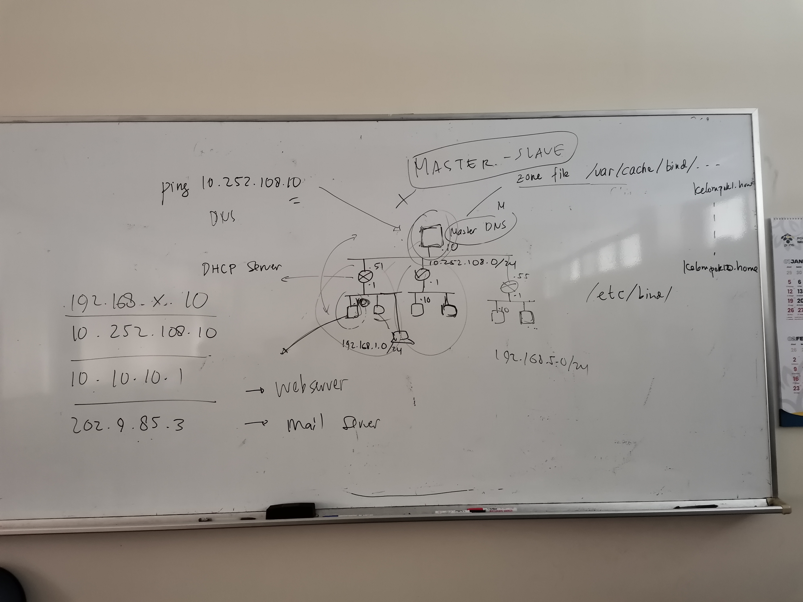
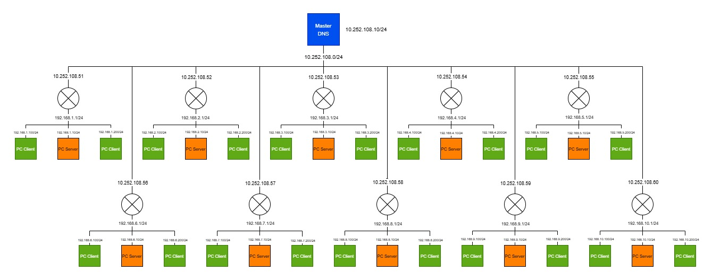
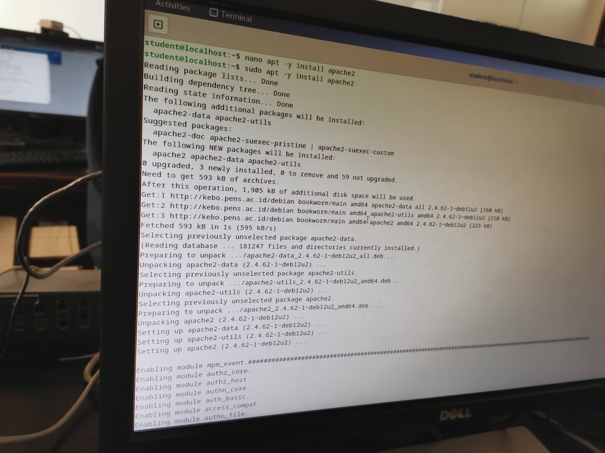
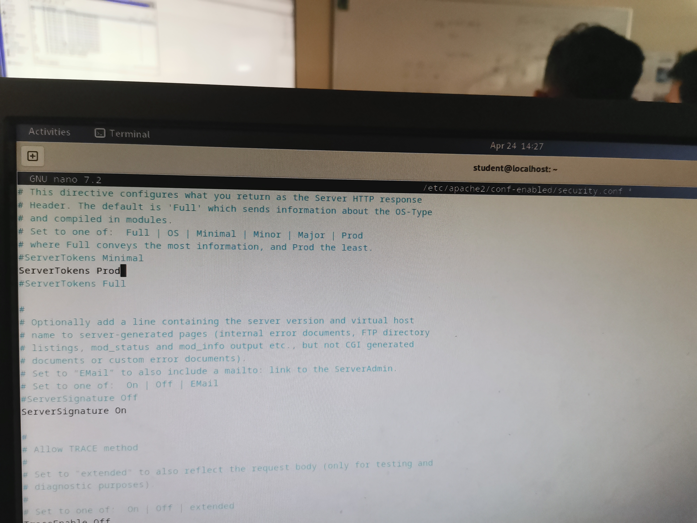
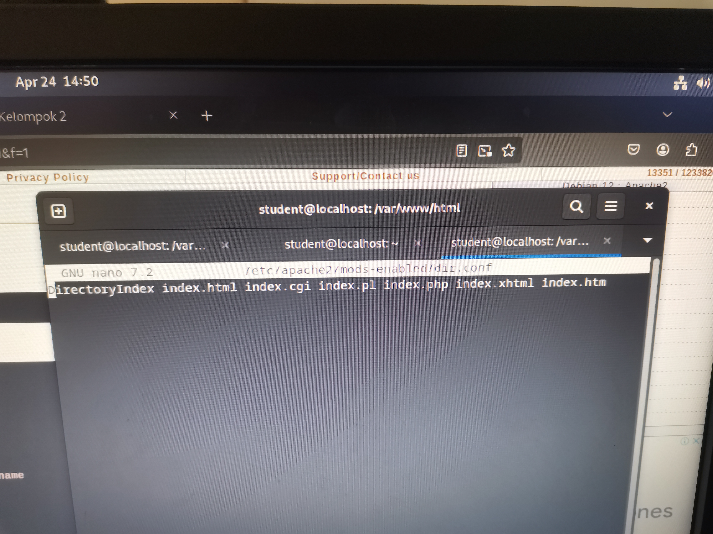
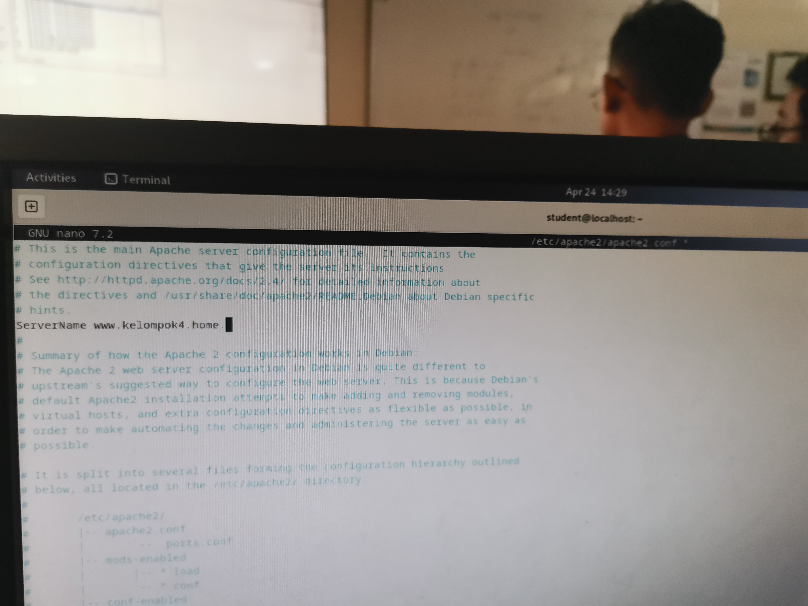
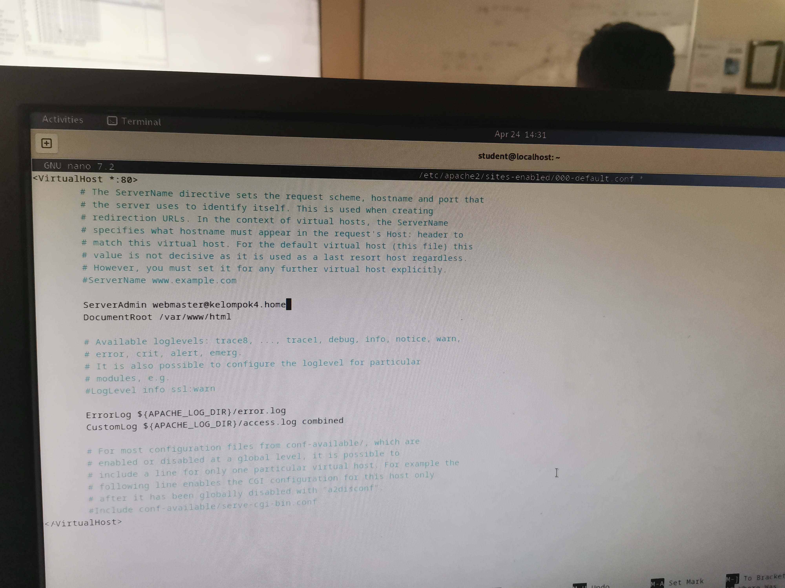

<div align="center">
  <h1 class="text-align: center;font-weight: bold">Praktikum <br>Workshop Administrasi Jaringan</h1>
  <h3 class="text-align: center;">Dosen Pengampu : Dr. Ferry Astika Saputra, S.T., M.Sc.</h3>
</div>
<br />
<div align="center">
  
  <h3 style="text-align: center;">Disusun Oleh : </h3>
  <p style="text-align: center;">
    <strong>Dewangga Wahyu Putera Wangsa (3123500007)</strong><br>
  </p>

<h3 style="text-align: center;line-height: 1.5">Politeknik Elektronika Negeri Surabaya<br>Departemen Teknik Informatika Dan Komputer<br>Program Studi Teknik Informatika<br>2025/2026</h3>
  <hr><hr>
</div>

# Konfigurasi DNS Host
![[Pasted image 20250430123753.png]]
## Konfigurasi Jaringan Internal
### Instalasi BIND

Masuk root, dan gunakan command dibawah untuk menginstall bind9

```bash
root@dlp:~# apt -y install bind9 bind9utils
```

### Konfigurasi dan Penyesuaian BIND

Menambahkan file konfigurasi baru yaitu `named.conf.internal-zones` ke dalam file utama konfigurasi BIND `/etc/bind/named.conf`




### Konfigurasi akses kontrol dan kebijakan query pada BIND DNS Server


- **Menentukan ACL (Access Control List)**
  - Membuat ACL bernama `internal-network` untuk jaringan **192.168.4.0/24**. Dimana jaringan ini adalah jaringan dari Mikrotik yang sudah diberikan untuk kelompok 4
  - ACL ini digunakan untuk menentukan siapa saja yang diizinkan mengakses layanan DNS.
- **Mengatur kebijakan query dan transfer zona**
  - `allow-query { localhost; internal-network; };` → Hanya mengizinkan **localhost** dan jaringan **internal** untuk melakukan query ke DNS server.
  - `allow-transfer { localhost; };` → Hanya mengizinkan **localhost** untuk melakukan transfer zona, biasanya untuk secondary DNS.
- **Mengaktifkan rekursi**
  - `recursion yes;` → Mengizinkan pencarian rekursif, yang berguna untuk melakukan resolusi nama domain selain zona yang dikelola sendiri.
- **Mengatur validasi DNSSEC dan konfigurasi IPv6**
  - `dnssec-validation auto;` → Mengaktifkan validasi DNSSEC secara otomatis.
  - `listen-on-v6 { any; };` → Konfigurasi agar BIND mendengarkan koneksi IPv6.

### Konfigurasi Zona DNS di BIND


- **Zona Forward (kelompok4.home)**
  - Zona ini digunakan untuk menerjemahkan **nama domain ke alamat IP**.
  - Disimpan dalam file **`/etc/bind/kelompok4.home.lan`**.
  - Bertindak sebagai **master** (utama), artinya server ini adalah sumber resmi data DNS untuk domain tersebut.
  - `allow-update { none; };` → Tidak mengizinkan update dinamis ke zona ini.
- **Zona Reverse (4.168.192.in-addr.arpa)**
  - Zona ini digunakan untuk **menerjemahkan alamat IP ke nama domain** (reverse lookup).
  - Disimpan dalam file **`/etc/bind/4.168.192.db`**.
  - Juga bertindak sebagai **master**, dengan **update dinamis dinonaktifkan**.

### Konfigurasi opsi BIND untuk menggunakan hanya IPv4 dan menonaktifkan IPv6


**Mengedit file `/etc/default/named`**

- Menambahkan opsi `OPTIONS="-u bind -4"`, yang menginstruksikan BIND untuk hanya menggunakan **IPv4** dan mengabaikan **IPv6**.
- Ini berguna jika jaringan Anda hanya menggunakan IPv4 dan ingin menghindari log error terkait IPv6.

## Konfigurasi Zone Files

### Pembuatan dan konfigurasi file zona forward lookup pada BIND DNS Server

Buat file zona yang memungkinkan server menerjemahkan nama domain menjadi alamat IP.
Konfigurasikan seperti di bawah ini menggunakan Jaringan internal [**192.168.4.0/24**.], Nama domain [kelompok4.home].


Konfigurasi ini sudah disediakan dari PC Pusat jaringan dari semua kelompok, sehingga konfigurasinya hanya perlu disamakan saja. Serial pada konfigurasi diganti dengan tanggal konfigurasi dilakukan. Pada konfigurasi di atas menggunakan ``ns`` yaitu **Name Server** yang berfungsi untuk menerjemahkan nama domain (seperti kelompok4.home) menjadi alamat IP.
### Pembuatan dan konfigurasi file zona reverse lookup pada BIND DNS Server.

Buat file zona yang memungkinkan server menerjemahkan alamat IP menjadi nama domain.
Konfigurasikan seperti di bawah ini menggunakan Jaringan internal [**192.168.4.0/24**.], Nama domain [kelompok4.home].


## BIND: Verify Resolution

### Restart BIND untuk menerapkan perubahan

Masuk root dan gunakan command dibawah ini

```bash
root@dlp:~# systemctl restart named
```

### Konfigurasi DNS Client untuk menggunakan DNS Server sendiri


File **`/etc/resolv.conf`** digunakan oleh sistem Linux untuk menentukan **DNS server mana yang akan digunakan untuk melakukan query DNS** (resolving domain ke IP dan sebaliknya).
### DNS Query menggunakan DiG (Domain Information Groper) untuk Forward Lookup.
#### Testing pada PC yang digunakan untuk konfigurasi


Perintah di atas digunakan untuk **mengecek resolusi nama domain ke alamat IP (Forward DNS Lookup)** dengan memanfaatkan **DNS Server yang telah dikonfigurasi**. Dapat dilihat pada gambar, ``ANSWER: 1`` menandakan bahwa server DNS memberikan satu jawaban atau respons dari query yang dikirimkan yang artinya DNS Server sudah berhasil terkoneksi.

#### Testing pada PC lain yang terhubung pada IP jaringan yang sama


Gambar di atas adalah konfigurasi resolv.conf pada PC lain yang terhubung pada IP jaringan yang sama pada PC yang digunakan untuk konfigurasi, dapat dilihat pada gambar bahwa nameserver diubah menjadi IP yang digunakan untuk konfigurasi tadi. 

**Gambar di bawah adalah hasil testing dig pada pc lain yang terhubung pada jaringan IP yang sama**


# Konfigurasi Web Server

## Instalasi Apache2

```bash
root@www:~# apt -y install apache2
```

Gunakan perintah di atas untuk melakukan instalasi apache2


## Konfigurasi Apache2

### Konfigurasi Security (/etc/apache2/conf-enabled/security.conf)



**Fungsi**:
- Membatasi informasi yang ditampilkan di header HTTP respons server
- Opsi "Prod" adalah level paling ketat, hanya menampilkan "Apache" tanpa detail tambahan
- Mencegah pengungkapan versi Apache, modul yang digunakan, dan sistem operasi
- Ini adalah praktik keamanan penting karena mengurangi information disclosure

### Konfigurasi Directory Index



Pada Konfigurasi ini seharusnya diubah menjadi hanya meninggalkan ``index.html`` dan ``index.htm``, tetapi tidak diubahpun outputnya akan tetap sama. Pengubahan menjadi hanya ``index.html`` dan ``index.htm`` bertujuan untuk:
- Menentukan file yang dicari Apache ketika client mengakses URL tanpa menentukan file spesifik
- Membatasi file default hanya ke index.html dan index.htm (file HTML statis)
- Secara default konfigurasi Apache biasanya menyertakan index.php, index.cgi dan lainnya
- Penghapusan file dinamis (seperti .php) dari DirectoryIndex menambah keamanan

### Konfigurasi ServerName



Konfigurasi ini berfungsi untuk:
- Mendefinisikan nama host utama server
- Membantu Apache mengenali dirinya sendiri
- Menghindari pesan error "Could not reliably determine the server's fully qualified domain name"
- Penting untuk konfigurasi virtual host dan penanganan redirect
- Mendukung resolusi yang tepat ketika server memiliki beberapa alamat IP atau domain

### Konfigurasi Email Administrator



Konfigurasi ini berfungsi untuk:
- Menetapkan alamat email administrator server
- Ditampilkan pada halaman error server default (seperti 404, 500)
- Memberikan cara kontak bagi user yang mengakses ketika terjadi masalah
- Merupakan praktik profesional untuk pengelolaan server

### Penerapan Konfigurasi (Reload Apache2)

Gunakan command ini untuk menerapkan konfigurasi yang sudah diterapkan
```bash
root@www:~# systemctl reload apache2
```

Jika Konfigurasi sudah di reload dan berhasil, maka bisa di-test dengan browser domain yang sudah dikonfigurasi dari awal tadi.

